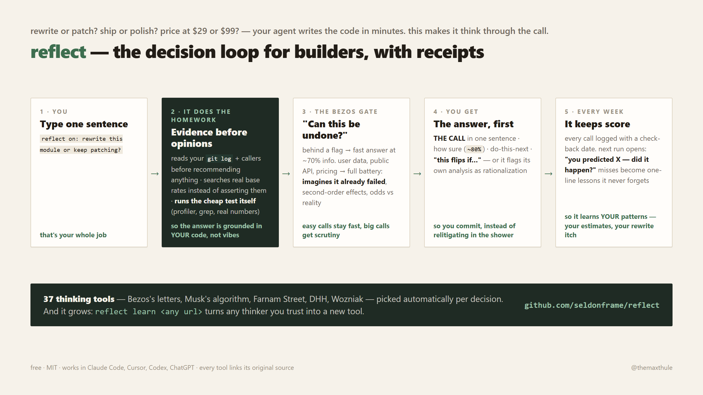

# reflect — for builders who ship: Bezos-level thinking on every build decision, in 5 minutes

**The problem with your decisions isn't information. It's honesty.** Every
framework you've read is available to you and unused at the moment it matters.
This makes your AI fire them — at the exact moment they bite.

You're mid-build. Claude Code, Cursor, Codex — doesn't matter. And the decisions
come at you all day:

*Rewrite this mess or patch it? Ship now or polish? Build auth myself or pay for
it? Kill the feature nobody uses? Postgres or the shiny thing?*

And because building something means selling it too:

*Price at $29 or $99? Take the agency deal? Niche down or stay broad? Quit the
job? Monetize the side project or keep it free?*

Most builders answer all of these with whatever mood they're in. The best —
Bezos, Musk, Munger, DHH, Tobi Lütke — wrote down *how they think* before they
answer. This loop treats "raise my prices" with the same rigor as "rewrite the
module."

This turns that thinking into something your AI **runs** on your actual project.



You type one sentence:

```
reflect on: should I rewrite this module or keep patching it?
```

Five minutes later you have:

- **A straight answer** — first thing you read, in plain words. Not "here are
  some considerations."
- **How sure it is** (a real number, like ~75%), so you know whether to act now
  or test first.
- **The exact next step**, so the analysis turns into a commit, not a doc.
- **"This flips if…"** — the 1-3 things that would change the answer, so you
  stop relitigating it in the shower.

## It reads your code before it opines

This is the part generic advice can't do. Connected to your repo, the loop:

- **Runs `git log` before recommending a rewrite** — "why does this exist?" gets
  answered by history, not vibes. (The most expensive sentence in software is
  "how hard could a rewrite be.")
- **Searches for base rates instead of asserting them** — "most migrations like
  this take 3x the estimate" comes with a source or an "I'm estimating" label,
  never disguised as fact.
- **Runs the cheap test instead of describing it** — if the answer hinges on a
  benchmark, a grep, or checking real usage numbers, it does that first. An
  hour of evidence beats a page of reasoning.

## What's in the loop

1. **First it asks: "can this be undone?"** Bezos's rule. Reverting a shipped
   flag costs a bad hour → you get a fast answer at ~70% information, because
   slow-deciding reversible things is how projects stall. Deleting user data,
   a public API promise, a pricing change → it slows down and runs the full
   battery: rebuild the logic from first principles, imagine the decision
   already failed and find what killed it, check second-order effects, check
   the odds against base rates.
2. **It attacks its own answer before you see it.** Ten moves run against its
   lean (question the requirement, run the arithmetic, find the disguised
   option, set the kill threshold, mirror the deal…) — then it fires the 1-2
   thinkers MOST HOSTILE to its conclusion from a 37-tool library (Bezos's
   letters, Musk's algorithm, Farnam Street, DHH, Tobi Lütke, Wozniak — all
   sourced). On irreversible calls it spawns an independent adversary that
   gets the facts but not the lean. Every card shows THE CASE AGAINST — the
   best opposing argument, which earned that line by losing.

## It grows with you: `reflect learn <source>`

Found a thinker whose judgment you trust? Point the loop at them:

```
reflect learn https://some-essay-that-changed-how-you-build.com
```

It fetches the source live, compacts it into a new lens file, and wires it into
the routing — your library compounds the same way your codebase does. (The
builders' pack in this repo was added exactly this way.)

## Install (30 seconds)

**Claude Code:**
```bash
git clone https://github.com/seldonframe/reflect ~/.claude/skills/reflect
```
Then say `reflect on <the thing you're stuck on>`. Done.

**Cursor / Codex:** paste [PROMPT.md](PROMPT.md) into your `AGENTS.md`.
**ChatGPT / Gemini / Claude.ai:** paste [PROMPT.md](PROMPT.md) into custom
instructions or the top of a chat. Same loop, no setup.

**Your first 10 minutes:** read [one example run](examples/example-reflect.md)
(30 seconds — it shows the git-history homework and the answer card), then run
your first reflect from [STARTER-QUESTIONS.md](STARTER-QUESTIONS.md) — it starts
with the five every builder is currently avoiding, like *"should I ship this now
or keep polishing?"* and *"which dependency would hurt most if it died
tomorrow?"* Want to add a thinker you trust? [CONTRIBUTING.md](CONTRIBUTING.md)
has the lens template.

## It fires itself

The skill instructs your agent to run the loop unprompted whenever the work
hits a choice whose undo cost exceeds a bad day — depth allocated by the
agent's own judgment, which means the skill gets *better* as models get
smarter, not stale. "start from first principles" also triggers it, aimed at
rebuilding your options from the ground up. For extra reliability in other
tools, add one line to your CLAUDE.md / AGENTS.md:

```
When I'm visibly going back and forth on a decision (pros/cons lists,
"should we X or Y", "I can't decide"), offer to run reflect on it — once.
```

## Make it yours (2 minutes, biggest upgrade)

Copy `CONTEXT.md.example` → `CONTEXT.md`: your settled decisions (so it never
re-argues your stack), what you usually decide on, how bold you want the
answers. Every answer lands in *your* project instead of generic advice.

## Credits & sources

The thinking belongs to the thinkers. Every lens file links its source — most
are [Farnam Street](https://fs.blog) essays and Knowledge Project conversations
(read/listen to the originals; they're excellent), plus Jeff Bezos's shareholder
letters and the builders listed above. This repo is paraphrased compactions with
attribution, not copies. The loop, the routing, the scoreboard, and
`reflect learn` are original.

---

Built by the team behind [SeldonFrame](https://github.com/seldonframe/seldonframe) —
an open-source platform where AI agents run your front office (calls, bookings,
CRM, follow-ups). Loops like this one are how we build it.
